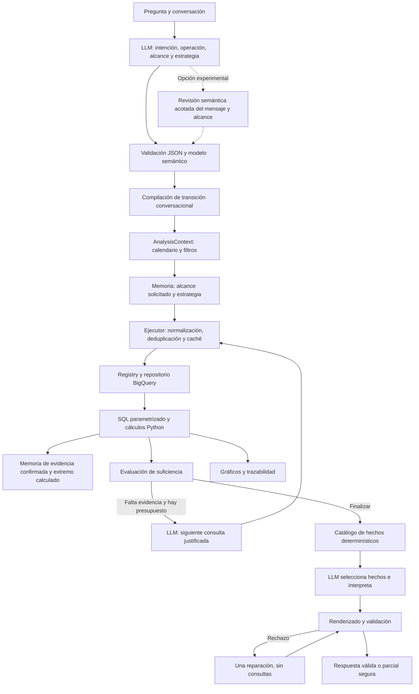

# Cambios de arquitectura del agente BI

Esta implementación separa interpretación, alcance, investigación, cálculo y presentación. La revisión posterior de memoria y transiciones está en [CONVERSATION_STATE_AUDIT.md](CONVERSATION_STATE_AUDIT.md). La comparación de resultados reales, incluidos fallos, está en [BENCHMARK_AGENTE_BI.md](BENCHMARK_AGENTE_BI.md); las limitaciones y el dictamen están en [AUDITORIA_AGENTE_BI_FINAL.md](AUDITORIA_AGENTE_BI_FINAL.md).

## Flujo implementado

El código valida el objeto completo después de compilar la transición. El diagrama separa ambas responsabilidades conceptualmente. Los límites temporales de la tabla se recuperan en una consulta agregada o desde caché; no se consulta cobertura repetidamente por costumbre.

## Decisiones

1. **Interpretación mediante LLM, con contrato estructurado.** El planner no reconoce marcas o años mediante listas de preguntas. Valida dimensiones, métricas, intención, operación conversacional y presupuesto. Los nombres comerciales sin tipo siguen `default_entity_dimension` del modelo semántico; una dimensión de entidad diferente necesita mención explícita o contexto previo.
2. **Intención y operación son distintas.** Cambiar el año conserva el objetivo previo. Un desglose de una comparación conserva la variación como objeto de análisis. `transitions.py` compila esas operaciones declaradas por el LLM y puede reutilizar su estrategia anterior, retirando argumentos del alcance viejo. No inspecciona el texto de la pregunta ni contiene entidades o años particulares.
3. **Alcance central.** `AnalysisContext` conserva métrica, filtros, periodo solicitado, referencia, cobertura, observación e intención. Las consultas adicionales pueden estrechar el alcance, pero no ampliarlo silenciosamente. Los filtros compartidos por todas las consultas iniciales forman parte del alcance base, evitando que la memoria los pierda.
4. **Calendario determinístico.** `periods.py` resuelve años, meses, rangos, YTD, ventanas recientes, referencias y picos. Ajusta comparaciones a ventanas equivalentes, incluidos años bisiestos. La cobertura global no certifica integridad diaria ni completitud individual de cada entidad.
5. **Presupuesto por intención.** Lookup: una herramienta; ranking, tendencia y composición: hasta dos; comparación: hasta tres; diagnóstico y análisis abierto: hasta cinco; anomalías: hasta cuatro. Una corrección de argumentos puede agregar un intento. `max_agent_steps` permanece como límite de seguridad, no como condición normal de finalización.
6. **Ejecución desacoplada.** `ToolExecutor` normaliza aliases, aplica alcance, consulta caché, evita duplicados y registra evidencia. Los errores de argumentos/esquema admiten una corrección; ausencia de datos e infraestructura no provocan repetición indefinida. Un fallo opcional no invalida evidencia principal suficiente, pero queda en la traza.
7. **Capacidades genéricas con compatibilidad.** El registro expone 24 herramientas: mantiene las anteriores y agrega comparación de entidades de cualquier dimensión, drivers temporales, diferencias entre entidades, ratio, participación conjunta, catálogo genérico, anomalías y ranking dentro de grupos. Este último usa dos dimensiones y calcula denominadores por grupo antes de limitar filas. El catálogo del planner oculta wrappers redundantes; siguen siendo ejecutables mediante la fachada pública.
8. **Matemática fuera del modelo.** SQL calcula agregaciones, denominadores completos, shares y rankings antes de LIMIT. Python calcula comparaciones, concentración, estadísticas, cambios observados, picos y anomalías MAD. Los drivers son contribuciones contables de una partición: no causas de negocio. Porcentajes de contribución superiores a cien o negativos son posibles cuando hay compensaciones.
9. **Normalización limitada y explícita.** TRIM/UPPER para texto. No se unifican etiquetas semánticas distintas. Los valores ausentes se distinguen de categorías de negocio; se calculan participaciones de información conocida/desconocida. Una comparación con etiquetas inexistentes puede ofrecer valores exactos del catálogo y pedir aclaración.
10. **Narrativa mediante hechos.** `facts.py` prepara frases numéricas con alcance y procedencia. El LLM selecciona IDs y redacta interpretación e hipótesis; el renderer inserta los hechos y limita su cantidad. Se omite prosa cuantitativa opcional del modelo que duplicaría los hechos. No se sustituyen cifras inventadas por cifras parecidas. La compatibilidad con respuestas en texto sigue pasando por validación.
11. **Validación y reparación limitada.** Control de cifras, porcentajes, cobertura parcial, formatos incompletos, terminación del proveedor, varias causas no demostradas y estacionalidad insuficiente. Una reparación completa sin herramientas. Si falla, una respuesta parcial determinística preserva datos confirmados. Estos controles no constituyen un verificador semántico universal.
12. **Memoria por sesión.** Alcance base, referencias, entidades comparadas, estrategia inicial y pico calculado. La última profundización no reemplaza los filtros base. Historial enviado al proveedor acotado por mensajes/caracteres. Repositorio y caché independientes entre instancias del servicio.
13. **Interfaz y adjuntos.** Un servicio común para CLI/Streamlit. Claves de gráficos por turno, limpieza de adjuntos, PDF identificado por contenido y limitado, imágenes convertidas realmente a PNG. Visión solo si el modelo está configurado para ello. Portapapeles del servidor deshabilitado por defecto.
14. **Observabilidad reproducible.** Intención, operación, plan, alcance resuelto, propósito, SQL, parámetros, intentos, caché, validaciones, errores, tokens, duración y jobs BigQuery. Los JSON del benchmark conservan también salidas rechazadas para analizar fallos; no son respuestas aprobadas al usuario.

La revisión de salida exige que la participación conjunta conserve su porcentaje y denominador, que el ratio tenga nombre/unidad derivados y que los drivers identifiquen entidades o periodos. Los datos ausentes tienen una definición compartida entre SQL y Python y un aviso de calidad obligatorio cuando corresponde. El renderer elimina también fracciones/múltiplos numéricos escritos en palabras de los campos opcionales; mantiene los hechos calculados.

La interpretación de nombres de agrupación explícitos se usa como validación del plan, mediante etiquetas/sinónimos semánticos. No selecciona entidades ni herramientas por preguntas preconfiguradas. Esta comprobación lingüística es limitada y no sustituye la interpretación del LLM.

Al comparar en un seguimiento, el planner rechaza cambios de año literal que no aparecen en la solicitud ni coinciden con el foco heredado; las referencias relativas deben declararse simbólicamente. Cambiar solo la entidad conserva la referencia comparativa anterior. Los periodos opcionales vacíos se normalizan como ausencia antes de validar el contrato. La condición final de suficiencia también se aplica a análisis abiertos, independientemente de que el modelo decida detenerse.

Una validación adicional reconoce el seguimiento elíptico formado únicamente por conjunción y una entidad que el LLM ya identificó: no permite convertirlo en una comparación nueva entre entidades. Pide reparar el plan; no extrae nombres de un catálogo fijo ni despacha herramientas por texto. La gramática es acotada y su límite está documentado en la auditoría.

## Archivos y responsabilidades

| Archivo o grupo | Cambio principal |
|---|---|
| `src/agent/planner.py`, `prompts.py` | Contrato estructurado y roles separados de interpretación, investigación y redacción. |
| `src/agent/transitions.py` | Compilación de operaciones de seguimiento sin reglas sobre preguntas particulares. |
| `src/agent/analysis_context.py`, `periods.py` | Alcance y resolución temporal centralizados. |
| `src/agent/service.py` | Orquestación acotada; recuperación y finalización con evidencia confirmada. |
| `src/agent/execution.py`, `sufficiency.py` | Ejecución, deduplicación y suficiencia por capacidades. |
| `src/agent/llm.py`, `observability.py` | Transporte, límites, uso y trazas por etapa. |
| `src/agent/facts.py`, `finalization.py`, `response_validator.py` | Hechos calculados, selección narrativa, validación y fallback seguro. |
| `src/agent/memory.py`, `cache.py` | Memoria del alcance y estrategia; TTL, capacidad y copias independientes. |
| `src/analytics/calculations.py` | Estadística y métricas derivadas determinísticas. |
| `src/data/bigquery_repository.py`, `sql_guard.py` | SQL parametrizado, allowlist AST, cobertura y herramientas analíticas. |
| `src/tools/registry.py` | Esquemas, aliases seguros, clasificación de errores y nuevas capacidades. |
| `src/semantic/business_rules.yaml`, `dimensions.yaml` | Default de entidad y distinción marca/anunciante documentados. |
| `src/config.py`, `.env.example` | Presupuestos, timeouts, proveedor coherente, visión y límites del historial. |
| `src/visualization/charts.py` | Gráficos derivados de evidencia exitosa con contexto y periodo. |
| `agent.py`, `cli.py`, `app.py` | Fachada compatible, aislamiento de sesiones, UI y adjuntos. |
| `evaluations/benchmark.py`, `evaluator.py` | Benchmark real optativo y evaluación simulada sin llamadas externas implícitas. |
| `tests/` | Regresiones de contratos, cálculos, periodos, seguimientos, errores, validación, UI y adjuntos. |
| `requirements.txt` | Incorporación de sqlglot para analizar SQL. |
| `README.md` | Ejecución, configuración y límites reales del sistema. |

## Compromisos y alternativas descartadas

No se incrementó el límite de ocho pasos para ocultar loops. Tampoco se convirtió cada interacción en una secuencia fija de total, serie y rankings. El motor ejecuta capacidades elegidas por el LLM y compila operaciones conversacionales explícitas; el backend no contiene casos particulares de las marcas del benchmark.

Se mantuvo la reparación final limitada a una llamada. Esto limita costo y latencia, aunque puede producir un resultado parcial si el proveedor no cumple el contrato. La detección de errores semánticos arbitrarios, el control de acceso por usuario y la evaluación de todas las combinaciones posibles siguen siendo asuntos independientes de tener tests aprobados.

## Revisión del estado conversacional — 12 de septiembre de 2026

`requirements.py` compila las nuevas intenciones a capacidades: ranking por cambio, aceleración, extremo temporal, búsqueda de dimensiones y participación conjunta. `comparative.py` calcula resultados sobre particiones completas y conserva referencias temporales. El cambio absoluto es el criterio de crecimiento por defecto, declarado en la respuesta; el porcentual excluye bases no positivas. La aceleración necesita una tercera ventana comparable.

`filter_scope` mantiene profundidad; `breakdown` promueve filtros a ejes; `shift_period` distingue foco, referencia y extremo; `restore_scope` recupera un alcance anterior. Un desglose independiente con `scope_mode=replace` ya no hereda filtros ni comparaciones de otro análisis. Los valores explícitos del conjunto preceden a referentes incompletos de memoria. Una referencia temporal explícita precede a la heredada.

La memoria distingue `last_requested_scope`, `last_successful_scope`, `last_confirmed_evidence_scope` y `last_analysis_strategy`. Conserva solicitudes fallidas cuyo alcance se pudo validar. Si el proveedor falla antes de interpretar, guarda el mensaje pendiente; no inventa una estructura de alcance. La restauración tiene un historial finito de doce alcances y ocho referentes de entidades.

El catálogo de valores valida dimensiones categóricas pequeñas configuradas y ofrece alternativas exactas al único intento de reparación. Las pruebas nuevas incluyen ambas conversaciones completas en una instancia del servicio, siete controles negativos del evaluador y sus controles positivos. Los puntajes y límites actuales están en la auditoría conversacional; los resultados previos de 46 preguntas no acreditan estas nuevas clases.

La revisión semántica (`request_review.py`) es experimental y está desactivada por defecto (`PLAN_SEMANTIC_REVIEW=false`). Recibe el mensaje actual, la política semántica, el esquema y memoria compacta, sin herramientas ni SQL. Puede proponer correcciones antes de consultar, pero las pruebas reales mostraron que también introduce interpretaciones incorrectas. Al activarla agrega como máximo una revisión LLM por turno analítico de texto; sigue habiendo una sola reparación de plan. Las trazas conservan ambos tipos de resultado.

Al añadir solo un filtro se conservan también ejes, criterio y calendario. Restaurar una entidad recupera su objetivo más reciente; un nuevo desglose combinado requiere `analysis.restore_with_breakdown=true`. La validación de agrupación rechaza un eje explícito que continúa restringido por su propio filtro, salvo retención declarada por el usuario. Una revisión fallida conserva el alcance ya interpretable sin acreditarlo como evidencia.

Una comparación irresoluble tampoco borra los campos válidos de la solicitud. `UnresolvedComparisonError` conserva intención, filtros y foco con `unresolved_fields`; la consulta se rechaza y la referencia queda pendiente. El siguiente turno puede recuperarla, mientras la memoria de evidencia confirmada permanece separada.
